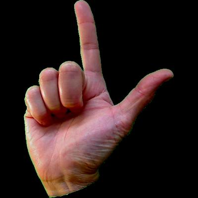
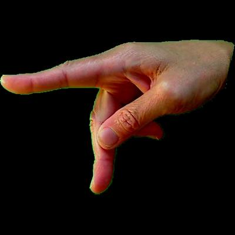
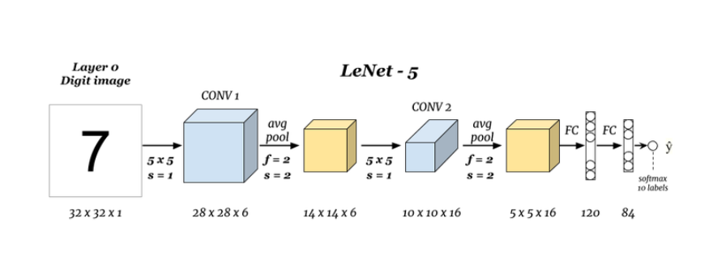
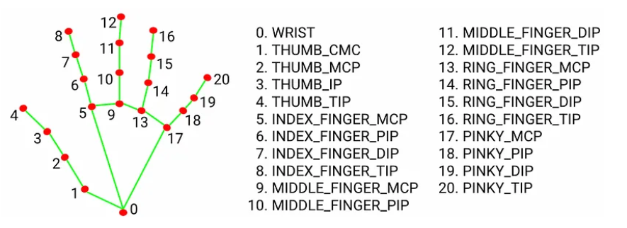
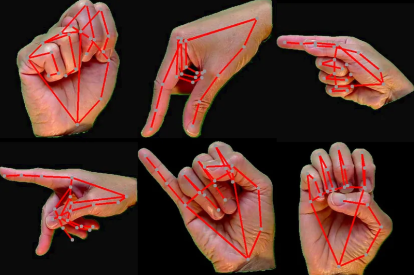

# ASL-Recognition
ASL recognition Model 

# Datasets used:
- https://www.kaggle.com/datasets/ayuraj/asl-dataset
- https://www.kaggle.com/datasets/grassknoted/asl-alphabet
- https://www.kaggle.com/datasets/debashishsau/aslamerican-sign-language-aplhabet-dataset

The final images used are in the Working compressed file

## The Data
Our dataset consists of 70 images of 26 characters that represent one letter in the ASL language.
  

# Methodologies applied
- Image classification using a modified LeNet-5 Architecture
- Cloud of points Classification using a modified PointNet Architecture and Mediapipe package

## LeNet
First I tried to solve the problem by a simple image classification model. I based my architecture in the LeNet-5 architecture but instead of parting from grayscale images I used RGB images.
 
The final architecture will consist of the following layers:
|    | Layer       | Parameters                             | Input            | Output           |
|----|-------------|----------------------------------------|------------------|------------------|
| 1  | Convolution | Conv2d(3, 6, kernel_size=5, padding=2) | (batch,3,32,32)  | (batch,6,32,32)  |
| 2  | Activation  | relu(x)                                | (batch,6,32,32)  | (batch,6,32,32)  |
| 3  | Pooling     | max_pool2d(x, kernel_size=2, stride=2) | (batch,6,32,32)  | (batch,6,16,16)  |
| 4  | Convolution | Conv2d(3, 6, 5)                        | (batch,6,16,16)  | (batch,6,12,12)  |
| 5  | Activation  | relu(x)                                | (batch,16,12,12) | (batch,16,12,12) |
| 6  | Pooling     | max_pool2d(x, kernel_size=2, stride=2) | (batch,16,12,12) | (batch,16,6,6)   |
| 7  | Flatten     | reshape(-1,576)                        | (batch,16,6,6)   | (batch,576)      |
| 8  | Linear      | Linear(16*6*6, 120)                    | (batch,576)      | (batch,120)      |
| 9  | Activation  | relu(x)                                | (batch,120)      | (bacth,120)      |
| 10 | Linear      | Linear(120,84)                         | (batch,120)      | (batch,84)       |
| 11 | Activation  | relu(x)                                | (batch,84)       | (batch,84)       |
| 12 | Linear      | Linear(84,26)                          | (batch,84)       | (batch,26)       |
| 13 | Activation  | softmax(x,dim=1)                       | (batch,26)       | (batch,26)       |

## MediaPipe + PointNet
Also I tried a different approach. Instead of training a model from images, using the Mediapipe.

### MediaPipe
MediaPipe is a module developed by google that includes several machine learning capabilities, one of them being [hand landmark recognition](https://developers.google.com/mediapipe/solutions/vision/hand_landmarker#get_started)
With this tool we are able to extract the (x,y,z) coordenates for 21 hand points.

So by having our dataset processed by this tool we would get something like this:

